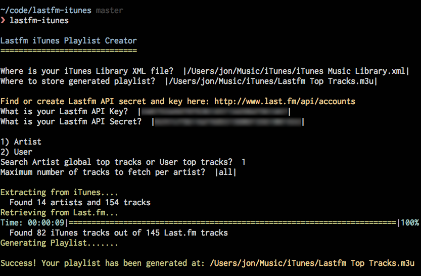
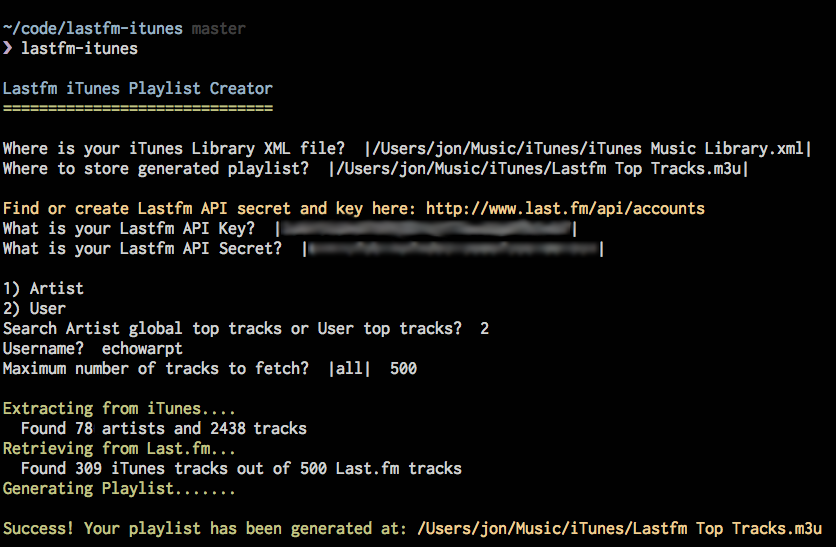

# Lastfm iTunes Playlist Creator

Easily create playlists of top Lastfm tracks from your iTunes library.

http://jonaustin.io/posts/lastfm-itunes

### Installation:

`$ gem install lastfm-itunes`

#### Follow the prompts to generate a playlist:

 `$ lastfm-itunes`

#### Creating a playlist from Artist top tracks:

#### Creating a playlist from User top tracks:

## Notes: 

* Each artist in the library requires a separate API call to Lastfm to get the top tracks. As a result generation could several minutes or more if there are hundreds or thousands of artists to fetch.

* It does not support tracks stored in the cloud. Haven't looked into whether this
is possible or not. Feel free to send a pull request.

* For convenience, lastfm credentials may be stored in ~/.config/lastfm-itunes.yml
If that file exists, then it will auto-fill the Lastfm API key and secret.

    api_key: ""  
    api_secret: ""

## Contributing

1. Fork it
2. Create your feature branch (`git checkout -b my-new-feature`)
3. Add tests.
4. Commit your changes (`git commit -am 'Add some feature'`)
5. Push to the branch (`git push origin my-new-feature`)
6. Create new Pull Request

License
-------

Copyright (c) 2014 Jon Austin.

Released under the MIT license. See `LICENSE.txt` for details.
